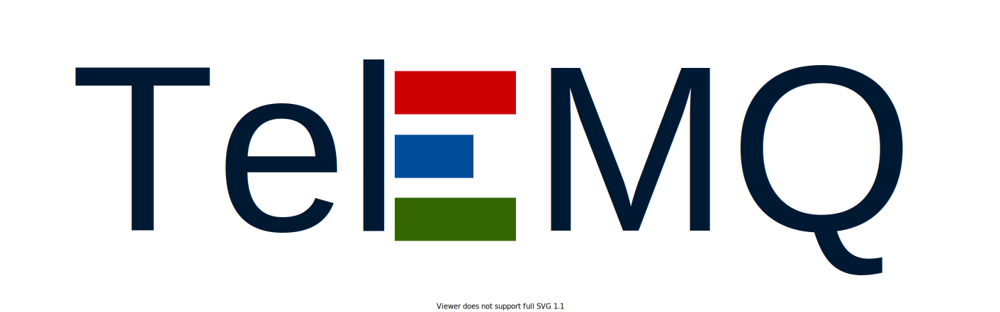

# TeleMQ



TeleMQ is an experimental MQTT broker implemented in Rust language. The broker implements [MQTT version 3.1.1](https://docs.oasis-open.org/mqtt/mqtt/v3.1.1/mqtt-v3.1.1.html) specification.

## Content

- [Build from source code](#build-from-the-source-code)
- [Run TeleMQ](#run-telemq)
- [Run in Docker](#run-in-docker)
- [$SYS Topics](#sys-topics)
- [License](#license)

## Build from the source code

In order to buil TeleMQ from the source code, you need to have [Rust](https://www.rust-lang.org/) programming language installed on your computer. The most common way to do it is via Rustup - a toolchain for managing Rust environment.

The official installation guide can be found on https://www.rust-lang.org/tools/install page.

Need more info about Rustup itself? Please follow the docs - https://rust-lang.github.io/rustup/.

Once you have Rust installed, clone the TeleMQ repo into an appropriate folder on your filesystem.

```
git clone https://github.com/telemq/telemq.git <DESTINATION_FOLDER>
```

After that go to the destination folder `cd <DESTINATION_FOLDER>` (you should have `Cargo.toml` file in the folder where you navigated) and run a `build` command from Cargo.

> Cargo is the Rust package manager. Cargo downloads your Rust package's dependencies, compiles your packages, makes distributable packages, and uploads them to crates.io, the Rust community’s package registry. You can contribute to this book on GitHub.

https://doc.rust-lang.org/cargo/

```
cargo build
```

This will producer a development build without any optimisations which might be necessary for the production. The binary file can is `<DESTINATION_FOLDER>/target/debug/telemq`.

In order to have a production-optimised binary, please, run the `build` command with the `--release` flag.

```
cargo build --release
```

Similarly to the dev build, the produced binary in `<DESTINATION_FOLDER>/target/release/telemq`.

Those binaries are statically linked and are self-sufficient, thus can be moved anywhere if needed.

## Run TeleMQ

Assuming, you either are in the same folder where you have `telemq` binary file or you have added this folder to your `$PATH`, you can ran it with a default config simply with following command:

```
telemq
```

TeleMQ being ran with a default config will open a plain TCP listener on `0.0.0.0:1883`, will allow to connect any client. And will allow those clients to subscribe and to publish to any topic name. Logs will be streamed to stdout, all logs starting from `INFO` level will be shown. Keep alive interval is **_120 secs_** - make sure your client sends at least one message (PUBLISH or PINGREQ) per this interval. Maximal number of connection is 10,000.

To see all options, run

```
telemq --help
```

To override the default behaviour, one can use a TeleMQ config file. Information about a configuration options can be found in [`telemq_config.md`](./docs/telemq_config.md).

## Run in Docker

TeleMQ Docker image is to be created.

## $SYS topics

$SYS topics are to be implemented.

## License

This project is licensed under either of

- Apache License, Version 2.0, ([LICENSE_APACHE](./LICENSE_APACHE.txt))
- MIT license ([LICENSE_MIT](./LICENSE_MIT.txt))

at your option.
